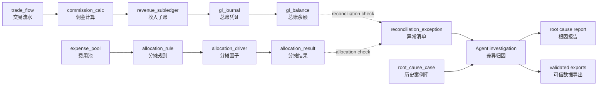
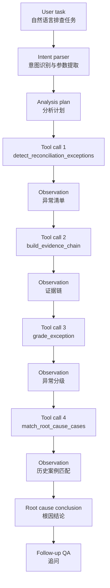

# Securities Month-End Reconciliation Agent

> **一句话定位**：面向证券公司财务月结的智能差异归因 Agent，自动完成“佣金收入勾稽 → 费用分摊校验 → 异常分级 → 证据链穿透 → 根因报告”的排查链路。


[](https://github.com/emmadong521-beep/securities-month-end-recon-agent/actions/workflows/tests.yml)


<!-- After deploying to Streamlit Community Cloud, replace the placeholder URL below. -->
<!-- [](https://your-app-name.streamlit.app) -->

中文名：**证券公司月结差异归因 Agent**

---

## Demo

Demo GIF placeholder: add `docs/assets/demo.gif` after recording a 30–60 second walkthrough.

Recommended screenshots are documented in [`docs/assets/README.md`](docs/assets/README.md):

- `agent_workbench.png`
- `evidence_chain.png`
- `severity_cases.png`
- `validated_export.png`

---

## Key Metrics

| Metric | Value |
|---|---:|
| Synthetic trading records | 384 |
| Commission calculation rows | 384 |
| Revenue subledger rows | 392 |
| GL journal lines | 782 |
| Allocation result rows | 959 |
| Exception categories covered | 7 |
| Detected reconciliation exceptions | 8 |
| Predefined seeded demo exceptions detected | 7 / 7 |
| Supported reconciliation scenarios | 2 |
| Agent tool-call steps per demo task | 5–7 |
| Unit tests | 33 passed |
| Data quality status | PASS |
| Exported validated data files | 3 |

> Note: the detection metrics above refer to predefined seeded demo scenarios in synthetic data, not production accuracy claims.

---

## Online Demo

The project can be deployed to Streamlit Community Cloud in deterministic mode without API keys.

Deployment guide:

- [Streamlit Deployment](docs/STREAMLIT_DEPLOYMENT.md)

After deployment, replace the placeholder Streamlit badge with the deployed app URL.

---

## Project Documentation

- [Design Decisions](docs/DESIGN_DECISIONS.md)
- [Testing and Quality](docs/TESTING_AND_QUALITY.md)
- [Capability Boundary](docs/CAPABILITY_BOUNDARY.md)
- [Demo Recording Guide](docs/DEMO_RECORDING_GUIDE.md)
- [Streamlit Deployment](docs/STREAMLIT_DEPLOYMENT.md)
- [Changelog](CHANGELOG.md)

---

## Business Architecture

### Data Reconciliation Flow



### Agent Workflow



---

## Core Design Principle

### Why Deterministic Agent Mode + Optional LLM Enhancement?

Financial reconciliation requires reproducible calculations, traceable evidence, and audit-friendly outputs.  
This project uses a hybrid architecture:

| Task | Implementation | Reason |
|---|---|---|
| Amount calculation | Deterministic code | Financial numbers must be reproducible |
| Reconciliation checks | Deterministic code | Rules must be traceable and testable |
| Allocation validation | Deterministic code | Cost allocation requires explicit logic |
| Evidence-chain construction | Deterministic code | Each conclusion should link back to source tables |
| Severity grading | Deterministic code | Risk classification should be explainable |
| Similar case matching | Deterministic scoring | Root-cause recommendations should be inspectable |
| Task understanding | Optional LLM | Natural language interaction improves usability |
| Plan wording and conclusion organization | Optional LLM | LLM is useful for expression, not financial calculation |

The LLM never acts as the source of truth for financial numbers.  
It only helps interpret tasks, organize conclusions, and respond to follow-up questions based on deterministic tool outputs.

---

## Capability Compared With Manual Month-End Investigation

| Dimension | Manual process | This project |
|---|---|---|
| Exception discovery | Finance users compare reports and tables manually | Deterministic checks scan synthetic transaction, subledger, GL, and allocation data |
| Root-cause tracing | Users inspect source records, batches, vouchers, and allocation rules separately | Evidence chain links each exception to source layers and breakpoints |
| Severity prioritization | Depends on user judgment and experience | Severity grading assigns HIGH / MEDIUM / LOW with reason |
| Historical experience reuse | Depends on individual memory or documents | Similar root-cause cases are matched from `root_cause_case` |
| Report generation | Manual explanation in documents or spreadsheets | Structured root-cause report can be generated and exported |
| Follow-up questions | Requires another manual lookup | Agent workbench can answer follow-up questions from existing context |

---

## Business Scope

This PoC simulates two month-end close scenarios for a securities company:

1. **Brokerage commission revenue reconciliation**

```text
trade_flow → commission_calc → revenue_subledger → gl_journal → gl_balance
```

2. **Branch and business-line cost allocation validation**

```text
expense_pool → allocation_rule → allocation_driver → allocation_result
```

All detailed customer, trade, voucher, branch, cost pool, and allocation data is synthetic. Public audit-report figures are used only for aggregate-scale calibration.

---

## Quick Demo Path

1. Start Streamlit: `./scripts/run_demo.sh`.
2. Open **Agent Workbench**.
3. Run sample task:

```text
请分析 2025-03 经纪佣金收入差异最大的异常，并定位根因。
```

4. Review the generated plan.
5. Review the tool-call trace.
6. Open the evidence chain.
7. Check severity grading and similar case matching.
8. Export the root-cause report.
9. Export validated monthly-close data.

---

## Explainable Agent Trace（可解释分析轨迹）

The Agent Workbench exposes an Explainable Agent Trace（可解释分析轨迹）for each run.

The trace shows:

- natural-language task input
- intent recognition
- generated analysis plan
- Tool-call Trace with tool names and inputs
- observation summaries and key numbers
- analysis decisions
- final conclusion and follow-up context
- downloadable trace JSON for review and replay

This is an analysis trace for business users and reviewers. It is not raw model reasoning. Amount calculation, reconciliation checks, evidence chains, severity grading, and case matching remain deterministic code outputs.

## Agent Workbench

The Agent workbench is designed around visible tool orchestration rather than opaque text generation.

It displays:

- User task
- Generated plan
- Tool-call trace
- Observations
- Evidence chain
- Severity grading
- Similar case matching
- Final root-cause conclusion
- Follow-up response

Core tools include:

- `detect_reconciliation_exceptions`
- `grade_exception`
- `build_evidence_chain`
- `match_root_cause_cases`
- `generate_root_cause_report`
- `export_root_cause_report`

---

## Example Natural Language Tasks

```text
请分析 2025-03 经纪佣金收入差异最大的异常，并定位根因。
```

```text
请检查 2025-06 费用分摊异常，说明差异发生在哪个环节。
```

```text
请分析异常 EXC_202503_001 的根因。
```

```text
这个异常是否影响总账？
```

```text
这个异常和哪些历史案例相似？
```

---

## Exception Severity Rules

`src/severity.py` assigns `HIGH / MEDIUM / LOW` based on exception type, affected layer, and amount impact.

| Severity | Typical Trigger | Handling Priority |
|---|---|---|
| HIGH | Revenue recognition, GL posting, duplicate posting, or short posting issues that may affect financial statement amounts | Immediate review |
| MEDIUM | Allocation ratio, rule version, or allocation driver issues that affect management accounting views | Same-day review |
| LOW | Small mapping or display-level issues that do not materially affect the monthly close result | Follow-up review |

---

## Seeded Demo Scenarios

| Period | Scenario | Type |
|---|---|---|
| 2025-03 | Brokerage commission batch not recognized into revenue subledger | Missing recognition |
| 2025-04 | Revenue subledger recognized, GL voucher short-posted | Short posting |
| 2025-05 | GL voucher duplicated | Duplicate posting |
| 2025-06 | Cost pool allocation ratio sum below 100% | Allocation ratio issue |
| 2025-07 | Stale allocation rule version used | Rule version mismatch |
| 2025-08 | Branch allocation driver missing | Missing driver |
| 2025-09 | Wealth-management distribution revenue mapped to brokerage commission account | Account mapping issue |
| 2025-10 | Wealth-management distribution revenue mapped to brokerage commission account again | Recurring account mapping issue |

---

## Validated Data Export

The project can export validated month-end data for downstream management accounting analysis.

```bash
.venv/bin/python -m src.export_validated_data
```

Outputs:

- `data/output/validated_actual_revenue.csv`
- `data/output/validated_allocated_expense.csv`
- `data/output/validation_summary.csv`

These files demonstrate how month-end validated data can feed downstream management accounting analysis, such as the companion project:

- [Securities Management Accounting Agent](https://github.com/emmadong521-beep/securities-management-accounting-agent)

---

## Run Locally

### Environment Setup

```bash
python3.11 -m venv .venv
source .venv/bin/activate
python -m pip install -e .
```

### Start Demo

```bash
./scripts/run_demo.sh
```

Or run manually:

```bash
python -m src.seed_data
python -m src.db
python -m pytest
streamlit run src/app.py
```

### Optional Audit Report Path

```bash
cp .env.example .env
```

Configure:

```bash
AUDIT_REPORT_PATH=/path/to/audit_report.pdf
```

The audit PDF is used only for aggregate-scale calibration and should not be committed.

---

## Volcengine Ark LLM Integration

The system works without an LLM provider. If no API key is configured, it uses deterministic mode.

Optional LLM configuration:

```bash
LLM_ENABLED=true
LLM_PROVIDER=volcengine
ARK_API_KEY=your_ark_api_key_here
ARK_BASE_URL=https://ark.cn-beijing.volces.com/api/coding/v3
ARK_MODEL=your_model_or_endpoint_id_here
LLM_TEMPERATURE=0.2
LLM_TIMEOUT_SECONDS=60
```

Notes:

- Do not commit `.env`.
- `ARK_MODEL` should be replaced with the actual Model ID from the Volcengine Ark console.
- LLM output is never used as the source of financial calculation.
- Reconciliation, evidence-chain construction, severity grading, and data export remain deterministic.

---

## Engineering Quality

CI workflow:

- [`.github/workflows/tests.yml`](.github/workflows/tests.yml)

Local commands:

```bash
python -m pytest -q
python -m pytest --cov=src --cov-report=term-missing --cov-report=html
python -m src.data_quality
make ci
```

Engineering docs:

- [Design Decisions](docs/DESIGN_DECISIONS.md)
- [Testing and Quality](docs/TESTING_AND_QUALITY.md)
- [Capability Boundary](docs/CAPABILITY_BOUNDARY.md)

---

## Data Quality

```bash
python -m src.data_quality
```

Outputs:

- `data/output/data_quality_report.md`
- `data/output/data_quality_report.json`

The data quality report covers:

- row counts
- primary-key uniqueness
- foreign-key integrity
- amount null checks
- reconciliation checks
- seeded demo exception detection
- public aggregate calibration
- final `PASS / WARNING / FAIL` status

---

## Core Tables

| Table | Purpose |
|---|---|
| `chart_of_accounts` | Securities finance chart of accounts |
| `branch_master` | Branch master data |
| `biz_line_master` | Business line master data |
| `customer_master` | Customer master data |
| `trade_flow` | Synthetic securities transaction flow |
| `commission_calc` | Commission calculation result |
| `revenue_subledger` | Revenue subledger |
| `gl_journal` | GL voucher lines |
| `gl_balance` | GL balances |
| `expense_pool` | Cost pools |
| `allocation_rule` | Allocation rules |
| `allocation_driver` | Allocation drivers |
| `allocation_result` | Allocation results |
| `interface_batch_log` | Interface batch logs |
| `reconciliation_exception` | Exception list |
| `root_cause_case` | Similar root-cause case library |

---

## Project Structure

```text
securities-month-end-recon-agent/
├── data/
│   ├── raw/
│   └── output/
├── docs/
├── scripts/
│   └── run_demo.sh
├── src/
│   ├── seed_data.py
│   ├── db.py
│   ├── agent.py
│   ├── severity.py
│   ├── case_matcher.py
│   ├── evidence_chain.py
│   ├── data_quality.py
│   ├── export_validated_data.py
│   ├── load_audit_report.py
│   └── app.py
├── tests/
├── .env.example
├── pyproject.toml
└── README.md
```

---

## Future Extensions

- Add voucher reversal and batch rerun workflow simulation.
- Add issue ownership and approval-status tracking.
- Add approval workflow and processing status.
- Add richer LLM explanations while preserving deterministic financial calculations.
- Add vector-based case retrieval as an optional enhancement.

---

## Disclaimer

This project is a research-oriented PoC. It uses public disclosures only for aggregate-scale calibration, and all detailed data is synthetic.

It does not represent any real securities company's internal customers, trades, vouchers, branches, accounting entries, or operating records. It does not contain non-public material information, customer private data, or commercial secrets. It is not investment advice.
