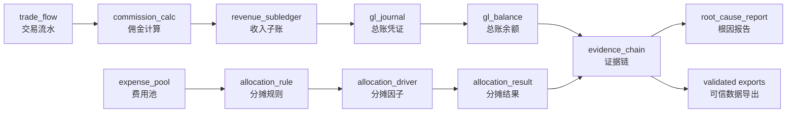
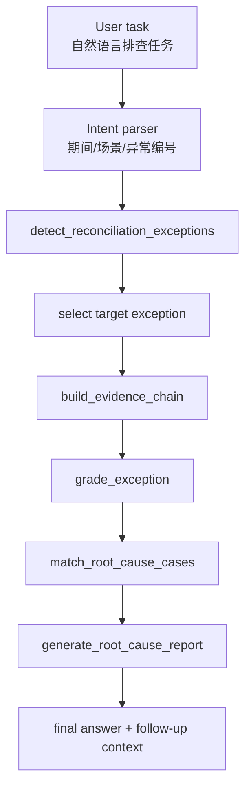

# Securities Month-End Reconciliation Agent

> 面向证券公司财务月结的智能差异归因 Agent，自动完成
> “佣金收入勾稽 -> 费用分摊校验 -> 异常分级 -> 证据链穿透 -> 根因报告”
> 的排查链路。


[![CI][ci-badge]][ci-workflow]


[ci-badge]: https://github.com/emmadong521-beep/securities-month-end-recon-agent/actions/workflows/tests.yml/badge.svg
[ci-workflow]: https://github.com/emmadong521-beep/securities-month-end-recon-agent/actions/workflows/tests.yml

<!-- After deploying to Streamlit Community Cloud, replace the URL below. -->
<!-- [](https://your-app-name.streamlit.app) -->

## Demo

Demo GIF placeholder: add `docs/assets/demo.gif` after recording a 30-60 second
walkthrough.

Recommended screenshots are documented in
[`docs/assets/README.md`](docs/assets/README.md):

- Agent workbench
- Evidence chain
- Severity and case matching
- Validated data export

## Key Metrics

Generated by:

```bash
python -m src.project_metrics
```

| Metric | Value |
|---|---:|
| Synthetic trading records | 384 |
| Commission calculation rows | 384 |
| Revenue subledger rows | 392 |
| GL journal lines | 782 |
| Allocation result rows | 959 |
| Embedded reconciliation exception scenarios | 7 |
| Detected reconciliation exceptions | 8 |
| Predefined seeded demo exceptions detected | 7 / 7 |
| Supported reconciliation scenarios | 2 |
| Agent tool-call steps per demo task | 5-7 |
| Unit tests | 33 passed |
| Data quality status | PASS |
| Exported validated data files | 3 |

## Quick Demo Path

1. Start Streamlit and open “月结批次概览”; select `2025-03` to see month-end
   exception volume.
2. Open “经纪佣金收入勾稽检查” to compare commission calculation, revenue
   subledger, and GL journal amounts in 万元.
3. Switch to `2025-06`, `2025-07`, and `2025-08` to inspect cost allocation
   ratio, rule version, and missing driver issues.
4. Open “异常清单” and filter by severity.
5. Open “异常证据链” to see the breakpoint, trace layers, root cause, and
   recommended action.
6. Open “Agent 工作台”; enter a natural-language task and review the plan,
   tool calls, observations, final answer, and follow-up response.
7. Open “可信数据导出” to generate validated revenue, allocated expense, and
   validation summary files.

Jump to:
[Architecture](#architecture) |
[Run Locally](#run-locally) |
[Engineering Quality](#engineering-quality) |
[Agent Workbench](#agent-workbench) |
[Data Quality](#data-quality)

## Architecture

### Data Flow



### Agent Tool Path



## Business Scope

This PoC simulates two month-end close scenarios for a securities company:

- Brokerage commission revenue reconciliation: `trade_flow -> commission_calc -> revenue_subledger -> gl_journal -> gl_balance`
- Branch and business-line cost allocation validation: `expense_pool -> allocation_rule -> allocation_driver -> allocation_result`

All detailed customer, trade, voucher, branch, cost pool, and allocation data is
synthetic. Public audit-report figures are used only for aggregate-scale
calibration. The project does not contain non-public information, customer
privacy data, or commercial secrets, and it is not investment advice.

## Run Locally

```bash
python3.11 -m venv .venv
.venv/bin/python -m pip install -e .
.venv/bin/python -m src.seed_data
.venv/bin/python -m src.db
.venv/bin/python -m pytest
.venv/bin/streamlit run src/app.py
```

One-command local launch:

```bash
./scripts/run_demo.sh
```

## Engineering Quality

CI workflow: [`.github/workflows/tests.yml`](.github/workflows/tests.yml)

The GitHub Actions workflow runs on `push` and `pull_request` with Python 3.11
and `LLM_ENABLED=false`. It performs:

- dependency installation with `pip install -e ".[dev]"`
- synthetic data generation and DuckDB initialization
- `python -m pytest -q`
- `python -m pytest --cov=src --cov-report=term-missing --cov-report=xml
  --cov-report=html`
- `python -m src.data_quality`
- upload of `htmlcov` and `coverage.xml` as artifacts

Local commands:

```bash
python -m pytest -q
python -m pytest --cov=src --cov-report=term-missing --cov-report=html
python -m src.data_quality
make ci
```

Current local coverage summary: [`data/output/coverage_summary.md`](data/output/coverage_summary.md)

Engineering docs:

- [`docs/DESIGN_DECISIONS.md`](docs/DESIGN_DECISIONS.md)
- [`docs/TESTING_AND_QUALITY.md`](docs/TESTING_AND_QUALITY.md)

## Agent Workbench

`src/agent.py` supports Deterministic Agent Mode + Optional LLM Enhancement.
The Agent never delegates amount calculation or reconciliation logic to the
model. It calls local tools and records each step:

- `detect_reconciliation_exceptions`
- `grade_exception`
- `build_evidence_chain`
- `match_root_cause_cases`
- `generate_root_cause_report`
- `export_root_cause_report`

The Streamlit Agent workbench displays the user task, generated plan, tool-call
trace, observations, severity, matched historical cases, final answer, and
follow-up responses.

## Exception Severity

`src/severity.py` assigns `HIGH / MEDIUM / LOW` based on amount, affected layer,
and exception type:

- `HIGH`: revenue recognition, GL posting, duplicate posting, or short posting
  issues that may affect financial statement amounts.
- `MEDIUM`: allocation ratio, rule version, or driver issues that affect
  management accounting views.
- `LOW`: small mapping or presentation-level issues.

## Historical Case Matching

`src/case_matcher.py` matches exceptions to the `root_cause_case` table using
deterministic scoring across scenario, exception type, suspected reason, and
evidence-chain breakpoint.

## Validated Data Export

```bash
.venv/bin/python -m src.export_validated_data
```

Outputs:

- `data/output/validated_actual_revenue.csv`
- `data/output/validated_allocated_expense.csv`
- `data/output/validation_summary.csv`

These files demonstrate how month-end validated data can feed downstream management accounting analysis.

## Volcengine Ark LLM Integration

Copy the environment template:

```bash
cp .env.example .env
```

Configure `.env`:

```bash
LLM_ENABLED=true
LLM_PROVIDER=volcengine
ARK_API_KEY=your_ark_api_key_here
ARK_BASE_URL=https://ark.cn-beijing.volces.com/api/coding/v3
ARK_MODEL=your_model_or_endpoint_id_here
LLM_TEMPERATURE=0.2
LLM_TIMEOUT_SECONDS=60
```

Notes:

- `ARK_MODEL` should be replaced with the actual Model ID from the Volcengine Ark console.
- Do not commit `.env`; it is ignored by `.gitignore`.
- If the key or model is not configured, the app automatically uses the
  deterministic fallback mode.
- LLM is used for task understanding and natural-language expression only.
  Reconciliation, evidence, severity, and amount calculations remain local code
  outputs.

## Data Quality

```bash
.venv/bin/python -m src.data_quality
```

Outputs:

- `data/output/data_quality_report.md`
- `data/output/data_quality_report.json`

The report covers row counts, primary-key uniqueness, foreign-key integrity,
amount null checks, reconciliation checks, seeded demo exception detection,
public aggregate calibration, and final `PASS / WARNING / FAIL` status.

## Core Tables

- `chart_of_accounts`
- `branch_master`
- `biz_line_master`
- `customer_master`
- `trade_flow`
- `commission_calc`
- `revenue_subledger`
- `gl_journal`
- `gl_balance`
- `expense_pool`
- `allocation_rule`
- `allocation_driver`
- `allocation_result`
- `interface_batch_log`
- `reconciliation_exception`
- `root_cause_case`

## Seeded Demo Scenarios

- `2025-03`: brokerage commission batch not recognized into revenue subledger.
- `2025-04`: revenue subledger recognized, GL voucher short-posted.
- `2025-05`: duplicate GL posting.
- `2025-09` / `2025-10`: wealth-management distribution revenue mapped to brokerage commission account.
- `2025-06`: allocation ratio sum below 100%.
- `2025-07`: stale allocation rule version used.
- `2025-08`: missing branch allocation driver.

## Future Extensions

- Add voucher reversal and batch rerun workflow simulation.
- Add approval status and issue ownership tracking.
- Add richer LLM explanation while preserving local deterministic amount calculation.
